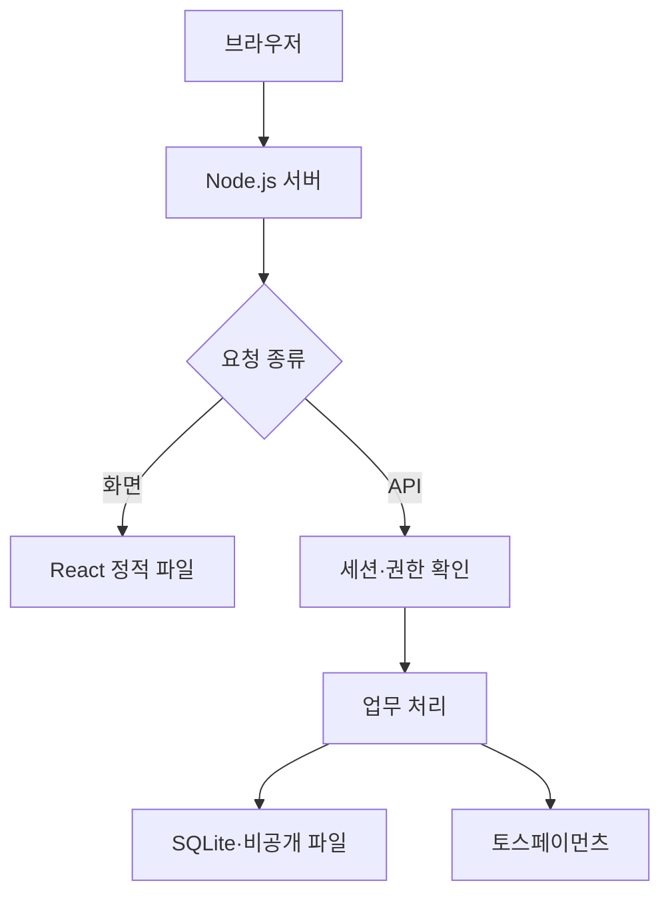

# 구성과 인증

이 문서는 현재 저장소의 실행 코드 기준입니다.

| 구성 요소   | 코드                                              | 역할                                                              |
| ----------- | ------------------------------------------------- | ----------------------------------------------------------------- |
| React 화면  | `app/workspace.tsx`                               | 서비스, 로그인, 설문, 마이페이지, 채팅, 관리자 설정               |
| 웹 서버     | `server/index.ts`                                 | 정적 화면, HTTP 요청 제한, 보안 헤더, 환경 설정, 관리자 최초 생성 |
| API 라우터  | `server/router.ts`                                | API 경로 연결 및 변경 요청 직렬 처리                              |
| 화면 주소   | `app/navigation.ts`                               | 메뉴·작업 상세 URL, 새로고침과 뒤로 가기 복원                     |
| 실시간 알림 | `server/events.ts`                                | 세션을 검증하는 SSE 연결, 변경 알림과 연결 정리                   |
| 인증 공통   | `app/api/workspace/core.ts`, `server/password.ts` | 비밀번호, 세션 쿠키, 사용자·권한·Origin 확인                      |
| 업무 API    | `app/api/workspace/route.ts`                      | 회원, 신청, 승인, 계좌이체, 채팅, 상태 관리                       |
| 파일 API    | `app/api/files`                                   | 첨부 및 소유권을 확인하는 다운로드                                |
| 온라인 결제 | `server/payments.ts`, `app/payments.ts`           | 서버가 확정한 주문·금액으로 결제 요청 및 결과 검증                |
| 데이터 저장 | `server/runtime.ts`, `db/migrations`              | SQLite, 마이그레이션, 비공개 파일                                 |

## 요청 흐름



`GET /api/workspace`는 공개 가격과 로그인 상태를 반환합니다. 로그인한 고객에게는 자신의 신청·알림을, 관리자에게는 전체 신청을 반환합니다. `?order=<id>`로 요청한 신청과 그 채팅·파일은 `own()`에서 소유권을 검사합니다. `POST /api/workspace`의 `action`별로 역할과 현재 상태를 다시 확인하므로 화면 버튼을 숨기는 것에만 의존하지 않습니다.

변경 요청은 한 Node 프로세스에서 직렬 처리됩니다. 관련 상태·채팅·알림을 SQLite 트랜잭션으로 저장합니다. SQLite와 파일 디렉터리를 하나의 서비스 인스턴스에서 사용해야 합니다. 여러 인스턴스로 확장하려면 DB·파일 저장소·동시성 제어를 먼저 바꿔야 합니다. 신청 목록은 최근 500건, 알림은 최근 50건을 표시합니다.

로그인한 브라우저는 `GET /api/events`에 SSE 연결을 유지합니다. 변경 요청이 성공하면 서버는 빈 변경 알림만 보내고, 브라우저가 기존 권한 검사를 거치는 API에서 목록·채팅·첨부를 다시 읽습니다. 이벤트에는 사용자 정보, 신청 번호, 메시지, 인증 토큰을 담지 않습니다. 새 메시지와 진행 상태는 새로고침 없이 반영되며, 작성 중인 설문과 채팅 입력은 덮어쓰지 않습니다. 스트림이 끊기거나 조회가 실패하면 5초 간격으로 재시도하고, 연결 복구·탭 복귀 시에도 동기화합니다. 서버는 알림 전송과 15초 간격의 연결 확인 시 세션을 다시 검사하며, 로그아웃·계정 삭제·비밀번호 변경으로 세션이 폐기되면 연결을 종료합니다.

화면은 `/?view=detail&order=<id>`처럼 메뉴와 작업 번호를 URL에 기록합니다. 새로고침과 브라우저 뒤로 가기는 이 주소를 사용하고, 로그인 상태는 기존 세션으로 확인합니다. 로그인 화면의 회원가입 모드와 선택한 서비스도 복원합니다. 비밀번호나 세션은 URL에 저장하지 않습니다. 결제 성공 URL의 검증 정보는 서버 확인이 끝난 후 작업 상세 주소로 교체합니다.

## 회원가입과 로그인

1. `register`는 이름·이메일·비밀번호를 검증하고 이메일을 소문자로 정규화합니다. 브라우저가 전송한 역할 값은 사용하지 않고 항상 `customer`를 생성합니다.
2. 비밀번호는 `server/password.ts`에서 임의 16바이트 salt와 scrypt(N=32768, r=8, p=1, 64바이트 출력)로 해시합니다. 원문은 저장하지 않습니다. 검증에는 `timingSafeEqual`을 사용합니다.
3. `login`은 해시를 비교합니다. 존재하지 않는 계정에도 해시 계산을 수행합니다. 이메일 및 신뢰할 수 있는 클라이언트 주소에 대한 시도 제한을 DB에 저장합니다.
4. 성공하면 UUID 두 개를 연결한 불투명 토큰을 쿠키로 보내고, 서버 DB에는 이 토큰의 SHA-256 해시와 사용자 ID, 7일 만료 시간만 저장합니다.
5. 이후 API는 쿠키의 토큰을 해시해 `sessions`와 `users`를 조회합니다. 만료 세션은 인증에 사용할 수 없습니다.

```ts
// app/api/workspace/core.ts
sessionCookie(token, 604800);
// adviser_session=...; HttpOnly; Secure; SameSite=Lax; Path=/; Max-Age=604800
```

HTTPS 운영 환경에서는 `Secure`를 적용합니다. 로컬 HTTP 개발에서는 이 플래그만 제외합니다. 쿠키는 `HttpOnly`이며 프런트엔드가 읽거나 localStorage에 저장하지 않습니다. JWT나 브라우저용 영구 인증 토큰은 사용하지 않습니다.

`logout`은 해당 세션을 삭제하고 쿠키를 만료시킵니다. 비밀번호 변경과 CLI 복구는 해당 사용자의 모든 세션을 폐기합니다. 초기화 CLI는 전체 세션을 삭제합니다.

## 관리자와 비밀값

관리자 ID는 `ADMIN`이며 내부 이메일 식별자는 `admin`입니다. 화면에는 일반 로그인 폼만 표시하고, 입력한 계정의 서버 역할에 따라 고객 또는 관리자로 로그인합니다. 관리자용 서비스 신청·새 신청 버튼은 표시하지 않으며 API에서도 관리자 신청 생성을 거부합니다. 관리자는 전체 작업에서 고객의 신청서·요청사항·첨부 파일을 확인하고 회원 관리와 운영 설정을 사용합니다.

`ADMIN_PASSWORD` 환경변수로 최초 계정을 생성합니다. 일반 회원가입은 관리자 역할을 만들 수 없습니다. 기존 관리자가 있으면 초기값을 덮어쓰지 않습니다. 최초 관리자 설정과 기존 계정 로그인은 기존 비밀번호와 호환됩니다. 신규 가입·비밀번호 변경·CLI 복구에는 `lib/password-policy.ts`의 공통 규칙을 사용합니다. 길이는 8~16자이며 특수문자를 1개 이상 포함해야 하고, 공백만으로 특수문자 조건을 충족할 수 없습니다. 같은 검증을 화면과 서버에 적용합니다.

운영 비밀번호, 비밀번호 해시, 세션, 결제 비밀 키는 소스나 README에 기록하지 않습니다. `.env`, `data/`, DB·업로드·백업 파일은 Git에서 제외합니다. 결제 클라이언트 키만 필요한 결제 요청 응답에 포함되며, 서버 비밀 키는 결제업체 API 호출에만 사용합니다. 실제 카드번호와 CVC는 Adviser 서버에서 수집하지 않습니다.

## 요청과 파일 보호

- 변경 API는 `Origin`이 서버의 `APP_URL`과 정확히 같아야 하며, cross-site 요청을 차단합니다. JSON API는 `application/json`을 요구합니다. SameSite 쿠키와 함께 CSRF를 방어합니다.
- 실제 수신 바이트 기준으로 일반 API는 200,000바이트, 파일 요청은 16MiB로 제한합니다. 파일 자체는 15MiB, 작업당 30개입니다.
- 서버는 클라이언트가 임의로 넣은 IP 헤더를 신뢰하지 않습니다. `TRUST_PROXY=true`는 신뢰하는 역방향 프록시 뒤에서만 사용합니다.
- 첨부 파일은 공개 정적 폴더 밖에 UUID 이름으로 저장하고, 다운로드 때 신청 소유권을 검사합니다. 응답은 attachment·nosniff·no-store로 반환합니다.
- 확장자 제한은 악성코드 검사와 다릅니다. 자동 바이러스 검사는 포함하지 않습니다.
- 결제 인증 쿠키나 원문 비밀번호를 로그에 출력하지 않습니다. 개인정보가 담긴 응답은 캐시하지 않습니다.

## 결제 상태의 신뢰 기준

관리자가 결과물을 등록하고 작업을 `complete`로 변경하면 고객은 수정을 요청하거나 **완료 확인 · 작업 종료**를 선택할 수 있습니다. `acceptComplete`는 결제가 완료된 해당 신청의 소유자만 호출할 수 있으며 상태를 `closed`로 바꾸고 대화 기록과 관리자 알림을 함께 저장합니다. 중복 확정은 거부합니다. 종료 후 새 채팅·수정·첨부·상태 변경은 막고, 기존 자료와 대화는 계속 조회·다운로드할 수 있습니다. 기존 운영상의 자료 정리 기능은 유지합니다.

승인 전에는 계좌이체 요청, 온라인 결제 창 생성, 결제 완료 처리를 거부합니다. 금액은 신청 생성 당시 서버 가격으로 고정됩니다. 계좌이체는 관리자가 실제 입금을 확인해야 작업 상태로 넘어갑니다.

온라인 결제는 서버가 생성한 주문 ID와 저장된 금액을 사용합니다. 성공 URL로 돌아왔다는 사실만으로 결제 완료 처리하지 않습니다. 서버가 토스페이먼츠를 호출해 주문 ID·paymentKey·총액·KRW·DONE 상태를 검증한 후 반영합니다. paymentKey는 결제 테이블에만 저장하고 일반 고객 API에 반환하지 않습니다.

확인 요청 전에 CONFIRMING 상태를 저장합니다. 결과가 불확실하면 추가 결제와 계좌이체 전환을 차단하고 `sync` 조회로 복구합니다. 동일 주문의 재확인은 멱등하게 처리합니다. 온라인 전액 취소는 결제업체의 CANCELED·잔액 0 응답으로 검증합니다. 웹훅 자동 동기화와 부분 환불 자동 처리는 포함하지 않습니다.

연동 참고: [토스페이먼츠 결제창 SDK](https://docs.tosspayments.com/sdk/v2/js/payment), [결제 API](https://docs.tosspayments.com/reference).
